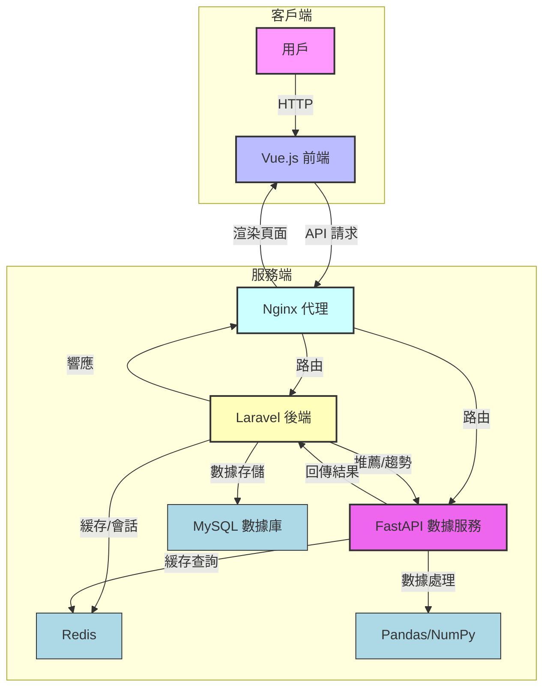

# 智能電商平台 MVP

這是一個基於 Laravel、FastAPI 和 Vue.js 的智能電商平台最小可行產品 (MVP)，通過 Docker 容器化部署，提供高效、可擴展的電商解決方案。

## 專案目標

- **技術整合**：結合 PHP (Laravel)、Python (FastAPI, Pandas)、JavaScript (Vue.js)。
- **模塊化設計**：分離前端 (Vue.js)、後端 (Laravel) 和數據服務 (FastAPI)。
- **數據智能**：實現商品推薦和銷售趨勢分析。
- **簡易部署**：使用 Docker Compose 確保環境一致性。

## 技術棧

- **前端**：Vue.js 3.x (基於 Vite，現代化 UI)。
- **後端**：Laravel 11.x (用戶認證、商品與訂單管理)。
- **數據服務**：FastAPI 0.111.0 (高性能數據分析與推薦 API)。
  - Pandas 2.x：數據處理。
  - NumPy 1.x：數值運算。
- **數據庫**：MySQL 8.0 (或 PostgreSQL)。
- **緩存**：Redis。
- **Web 服務器**：Nginx (統一代理)。
- **容器化**：Docker & Docker Compose。

## 系統架構

以下 Mermaid 圖展示系統組件與數據流：



### 架構說明

- **客戶端**：Vue.js 前端通過 Axios 發送 API 請求至 Nginx。
- **Nginx**：作為反向代理，路由請求至 Laravel 或 FastAPI。
- **Laravel 後端**：處理用戶認證、商品和訂單管理，與 MySQL 和 Redis 交互。
- **FastAPI 數據服務**：提供推薦和趨勢分析，依賴 Pandas/NumPy 處理數據。
- **數據流**：前端請求經 Nginx 分發，Laravel 處理業務邏輯，FastAPI 提供智能分析，結果通過 Nginx 返回前端。

## 核心功能

- **用戶管理**：註冊、登錄、個人資料管理。
- **商品管理**：商品瀏覽與詳情展示。
- **訂單管理**：購物車與簡化下單流程。
- **智能推薦 (FastAPI)**：
  - 熱門商品：基於銷量排序 (`/products/popular`)。
  - 個性化推薦：簡單協同過濾 (`/recommendations/user/{user_id}`)。
- **數據洞察 (FastAPI)**：每日銷售趨勢 (`/sales/trends`)。

## 專案結構

```
e-commerce-data-driven-mvp/
├── laravel-backend/           # Laravel 後端
│   ├── app/
│   ├── config/
│   ├── database/
│   ├── routes/
│   ├── .env.example
│   ├── composer.json
│   └── Dockerfile
├── python-backend/            # FastAPI 數據服務
│   ├── app/
│   │   └── main.py
│   ├── requirements.txt
│   └── Dockerfile
├── vue-frontend/              # Vue.js 前端
│   ├── src/
│   │   ├── components/
│   │   ├── router/
│   │   ├── views/
│   │   ├── App.vue
│   │   └── main.js
│   ├── public/
│   ├── package.json
│   ├── vite.config.js
│   └── Dockerfile
├── nginx/                     # Nginx 配置
│   ├── conf.d/
│   │   ├── laravel.conf
│   │   └── vue.conf
│   └── nginx.conf
├── docker-compose.yml
├── .gitignore
└── README.md
```

## 快速開始

### 前提條件

- Docker Desktop (含 Docker Compose)
- Git

### 安裝步驟

1. **克隆倉庫**：
   ```bash
   git clone https://github.com/BpsEason/e-commerce-data-driven-mvp.git
   cd e-commerce-data-driven-mvp
   ```

2. **配置環境**：
   - Laravel：
     ```bash
     cd laravel-backend
     cp .env.example .env
     ```
     編輯 `laravel-backend/.env`：
     ```dotenv
     APP_KEY= # 運行 `php artisan key:generate` 自動生成
     DB_CONNECTION=mysql
     DB_HOST=mysql
     DB_PORT=3306
     DB_DATABASE=ecommerce_db
     DB_USERNAME=root
     DB_PASSWORD=secure_password
     REDIS_HOST=redis
     FASTAPI_URL=http://python_app:8001
     ```
   - Vue.js：
     ```bash
     cd ../vue-frontend
     cp .env.example .env.development
     ```
     編輯 `vue-frontend/.env.development`：
     ```dotenv
     VITE_API_BASE_URL_LARAVEL=http://localhost/api
     VITE_API_BASE_URL_PYTHON=http://localhost/api-python
     ```
     返回根目錄：
     ```bash
     cd ..
     ```

3. **初始化專案**（如有 `create_project.sh`）：
   ```bash
   chmod +x create_project.sh
   ./create_project.sh
   ```

4. **啟動服務**：
   ```bash
   docker-compose up --build -d
   ```

5. **初始化 Laravel**：
   ```bash
   docker-compose exec laravel_app php artisan key:generate
   docker-compose exec laravel_app php artisan migrate --seed
   ```

   > **注意**：`vue_app` 容器自動運行 `npm install` 和 `npm run dev`。

### 訪問應用

- **前端**：`http://localhost`
- **FastAPI 文檔**：`http://localhost/api-python/docs`
- **Laravel API**：`http://localhost/api/products`

### 測試賬戶

使用以下賬戶登錄（需運行 `php artisan migrate --seed`）：
- **郵箱**：`test@example.com`
- **密碼**：`password`

## 技術細節

- **Vue.js 前端**：
  - 基於 Vue.js 3.x 和 Vite，通過 Axios 消費 API。
  - 結構化目錄：`components/`、`views/`、`router/`。
  - 環境變量：`.env.development` 和 `.env.production` 配置 API 端點。
- **Laravel 後端**：
  - 認證：Laravel Sanctum (API 優先)。
  - 數據模型：`users`、`products`、`orders`、`order_items`。
  - 緩存：Redis 提升性能。
  - API 端點：如 `/api/products`。
- **FastAPI 數據服務**：
  - 數據處理：Pandas 和 NumPy。
  - 端點示例：
    - 熱門商品：`GET /products/popular`
    - 用戶推薦：`GET /recommendations/user/{user_id}`
    - 銷售趨勢：`GET /sales/trends`
- **Docker Compose**：
  - 服務：`nginx`、`laravel_app`、`python_app`、`vue_app`、`mysql`、`redis`。

## 常見問題排查

- **README 顯示空白？** 確保文件位於根目錄，使用 UTF-8 編碼，檢查 GitHub 渲染。
- **服務無法啟動？** 查看日誌：`docker-compose logs -f`，檢查 `.env` 配置。
- **API 無法連接？** 
  - 驗證 `vue-frontend/.env.development` 的 `VITE_API_BASE_URL_LARAVEL` 和 `VITE_API_BASE_URL_PYTHON`。
  - 檢查 `nginx/conf.d/laravel.conf` 和 `vue.conf` 的 `proxy_pass`/`fastcgi_pass`。
- **Vue.js 無法加載？** 確認 `vite.config.js` 的 `server.port=8080`，且 `docker-compose.yml` 中 `vue_app` 無額外端口映射。

## 進階改進

- **性能優化**：
  - Redis 緩存頻繁查詢。
  - FastAPI 異步處理優化。
- **推薦系統**：
  - 升級協同過濾或深度學習模型。
  - 整合向量資料庫（如 Pinecone）。
- **CI/CD**：GitHub Actions 自動化測試與部署。
- **監控**：整合 Prometheus 和 Grafana。

## 貢獻

歡迎提交 Issue 或 Pull Request，遵循 [Contributor Covenant](https://www.contributor-covenant.org/zh-cn/version/2/0/code_of_conduct).

## 許可證

採用 [MIT 許可證](LICENSE).
