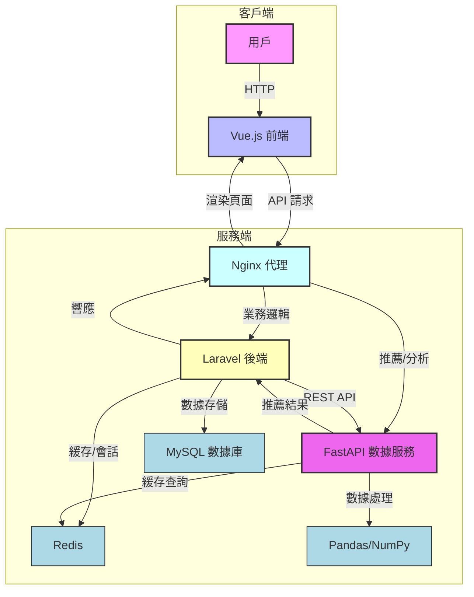

# 智能電商平台 MVP

這是一個基於 Laravel、FastAPI 和 Vue.js 的智能電商平台最小可行產品 (MVP)，通過 Docker 容器化部署，提供高效、可擴展的電商解決方案。系統採用模塊化設計，整合數據智能功能，支援商品推薦和銷售趨勢分析。

## 專案目標

- **技術整合**：結合 PHP (Laravel)、Python (FastAPI, Pandas)、JavaScript (Vue.js)。
- **模塊化設計**：分離前端 (Vue.js)、後端 (Laravel) 和數據服務 (FastAPI)，實現高內聚低耦合。
- **數據智能**：提供熱門商品推薦、個性化推薦和銷售趨勢分析。
- **簡易部署**：使用 Docker Compose 確保環境一致性與快速部署。

## 技術棧

- **前端**：Vue.js 3.x (基於 Vite，現代化 UI)。
- **後端**：Laravel 11.x (用戶認證、商品與訂單管理)。
- **數據服務**：FastAPI 0.111.0 (高性能數據分析與推薦 API)。
  - Pandas 2.x：數據處理。
  - NumPy 1.x：數值運算。
- **數據庫**：MySQL 8.0 (可選 PostgreSQL)。
- **緩存與佇列**：Redis。
- **Web 服務器**：Nginx (反向代理)。
- **容器化**：Docker & Docker Compose。

## 系統架構

以下 Mermaid 圖展示系統組件與數據流，體現模塊化設計與高效交互：



### 架構說明

- **客戶端**：Vue.js 前端通過 Axios 發送 API 請求至 Nginx，支援響應式用戶界面。
- **Nginx**：反向代理，路由請求至 Laravel（業務邏輯）或 FastAPI（數據分析）。
- **Laravel 後端**：
  - 處理用戶認證（Laravel Sanctum）、商品管理和訂單處理。
  - 與 MySQL 存儲數據，Redis 緩存會話和頻繁查詢。
- **FastAPI 數據服務**：
  - 提供熱門商品、個性化推薦和銷售趨勢分析，依賴 Pandas/NumPy 進行數據處理。
  - 通過 REST API 與 Laravel 通信。
- **數據流**：前端請求經 Nginx 分發，Laravel 處理業務邏輯並調用 FastAPI 獲取推薦數據，結果通過 Nginx 返回前端。

## 核心功能

- **用戶管理**：註冊、登錄、個人資料管理。
- **商品管理**：商品瀏覽與詳情展示。
- **訂單管理**：購物車與簡化下單流程。
- **智能推薦 (FastAPI)**：
  - 熱門商品：基於銷量排序 (`GET /products/popular`)。
  - 個性化推薦：簡單協同過濾算法 (`GET /recommendations/user/{user_id}`)。
- **數據洞察 (FastAPI)**：每日銷售趨勢分析 (`GET /sales/trends`)。

## 專案結構

```
e-commerce-data-driven-mvp/
├── laravel-backend/           # Laravel 後端
│   ├── app/
│   ├── config/
│   ├── database/
│   ├── routes/
│   ├── .env.example
│   ├── composer.json
│   └── Dockerfile
├── python-backend/            # FastAPI 數據服務
│   ├── app/
│   │   └── main.py
│   ├── requirements.txt
│   └── Dockerfile
├── vue-frontend/              # Vue.js 前端
│   ├── src/
│   │   ├── components/
│   │   ├── router/
│   │   ├── views/
│   │   ├── App.vue
│   │   └── main.js
│   ├── public/
│   ├── package.json
│   ├── vite.config.js
│   └── Dockerfile
├── nginx/                     # Nginx 配置
│   ├── conf.d/
│   │   ├── laravel.conf
│   │   └── vue.conf
│   └── nginx.conf
├── docker-compose.yml
├── .gitignore
└── README.md
```

## 快速開始

### 前提條件

- Docker Desktop (含 Docker Compose)
- Git

### 安裝步驟

1. **克隆倉庫**：
   ```bash
   git clone https://github.com/BpsEason/e-commerce-data-driven-mvp.git
   cd e-commerce-data-driven-mvp
   ```

2. **配置環境**：
   - **Laravel**：
     ```bash
     cd laravel-backend
     cp .env.example .env
     ```
     編輯 `laravel-backend/.env`：
     ```dotenv
     APP_KEY= # 運行 `php artisan key:generate` 自動生成
     DB_CONNECTION=mysql
     DB_HOST=mysql
     DB_PORT=3306
     DB_DATABASE=ecommerce_db
     DB_USERNAME=root
     DB_PASSWORD=secure_password
     REDIS_HOST=redis
     FASTAPI_URL=http://python_app:8001
     ```
   - **Vue.js**：
     ```bash
     cd ../vue-frontend
     cp .env.example .env.development
     ```
     編輯 `vue-frontend/.env.development`：
     ```dotenv
     VITE_API_BASE_URL_LARAVEL=http://localhost/api
     VITE_API_BASE_URL_PYTHON=http://localhost/api-python
     ```
   - **FastAPI**：
     ```bash
     cd ../python-backend
     cp .env.example .env
     ```
     編輯 `python-backend/.env`：
     ```dotenv
     DATA_PATH=/app/data/
     ```
     返回根目錄：
     ```bash
     cd ..
     ```

3. **初始化專案**（如有 `create_project.sh`）：
   ```bash
   chmod +x create_project.sh
   ./create_project.sh
   ```

4. **啟動服務**：
   ```bash
   docker-compose up --build -d
   ```

5. **初始化 Laravel**：
   ```bash
   docker-compose exec laravel_app php artisan key:generate
   docker-compose exec laravel_app php artisan migrate --seed
   ```

   > **注意**：`vue_app` 容器自動運行 `npm install` 和 `npm run dev`。

### 訪問應用

- **前端**：`http://localhost`
- **FastAPI 文檔**：`http://localhost/api-python/docs`
- **Laravel API**：`http://localhost/api/products`

### 測試賬戶

使用以下賬戶登錄（需運行 `php artisan migrate --seed`）：
- **郵箱**：`test@example.com`
- **密碼**：`password`

## 技術細節

- **Vue.js 前端**：
  - 基於 Vue.js 3.x 和 Vite，通過 Axios 消費 API。
  - 結構化目錄：`components/` (可復用組件)、`views/` (頁面)、`router/` (路由管理)。
  - 環境變量：`.env.development` 和 `.env.production` 配置 API 端點。
- **Laravel 後端**：
  - 認證：Laravel Sanctum 提供基於 Token 的 API 認證。
  - 數據模型：`users`、`products`、`orders`、`order_items`。
  - 緩存：Redis 存儲會話和頻繁查詢（如熱門商品）。
  - API：RESTful 端點（如 `GET /api/products`）。
- **FastAPI 數據服務**：
  - 數據處理：Pandas 和 NumPy 進行數據清洗與分析。
  - 端點示例：
    ```bash
    curl http://localhost/api-python/products/popular
    curl http://localhost/api-python/recommendations/user/1
    curl http://localhost/api-python/sales/trends
    ```
- **Docker Compose**：
  - 服務：`nginx` (代理)、`laravel_app` (PHP-FPM)、`python_app` (FastAPI)、`vue_app` (Vue.js)、`mysql` (數據庫)、`redis` (緩存)。

## 常見問題排查

- **README 顯示空白？** 確保文件位於根目錄，使用 UTF-8 編碼，檢查 GitHub 渲染。
- **服務無法啟動？** 查看日誌：`docker-compose logs -f`，檢查 `.env` 配置是否正確。
- **API 無法連接？** 
  - 驗證 `vue-frontend/.env.development` 的 `VITE_API_BASE_URL_LARAVEL` 和 `VITE_API_BASE_URL_PYTHON`。
  - 檢查 `nginx/conf.d/laravel.conf` 和 `vue.conf` 的 `proxy_pass` 或 `fastcgi_pass` 配置。
- **Vue.js 無法加載？** 確認 `vite.config.js` 中 `server.port=8080`，且 `docker-compose.yml` 中 `vue_app` 無額外端口映射。

## 進階改進

- **微服務架構**：
  - 進一步拆分為獨立服務（如用戶服務、商品服務、訂單服務），使用 API Gateway（如 Kong）統一管理。
  - 引入消息隊列（如 Kafka, RabbitMQ）實現異步通信，例如訂單處理後通知推薦服務更新數據。
- **推薦系統**：
  - 升級為混合推薦（協同過濾 + 基於內容），或採用深度學習模型（如 Transformer）。
  - 整合向量資料庫（如 Pinecone, Milvus）進行高效相似性檢索。
  - 實施 A/B 測試評估推薦效果，結合實時數據流處理（如 Flink）。
- **性能優化**：
  - 使用負載均衡器（如 HAProxy, AWS ELB）分發流量。
  - 實現讀寫分離、分庫分表，優化 MySQL 索引。
  - 使用 CDN 加速靜態資源分發（如圖片、CSS、JS）。
  - 實施頁面級緩存和 API 緩存，設計緩存失效策略。
- **CI/CD**：
  - 使用 GitHub Actions 自動化測試、構建和部署。
  - 採用 Terraform 或 Ansible 管理基礎設施，實現環境一致性。
- **監控與日誌**：
  - 整合 Prometheus 和 Grafana 監控性能指標（如響應時間、錯誤率）。
  - 使用 ELK Stack 或 Loki 進行日誌聚合與分析。
- **安全與合規**：
  - 實施 API 限流、CSRF/XSS 防護、SQL 注入防護。
  - 敏感數據（如用戶信息）加密存儲與傳輸。
  - 建立日誌審計機制，追蹤操作與問題。
- **前端工程化**：
  - 建立可復用組件庫與設計系統，確保 UI 一致性。
  - 考慮服務端渲染 (SSR) 或靜態站點生成 (SSG) 優化首屏加載和 SEO。
  - 實施代碼分割、按需加載和 Tree Shaking，減小打包體積。

## 貢獻

歡迎提交 Issue 或 Pull Request，遵循 [Contributor Covenant](https://www.contributor-covenant.org/zh-cn/version/2/0/code_of_conduct).

## 許可證

採用 [MIT 許可證](LICENSE).
